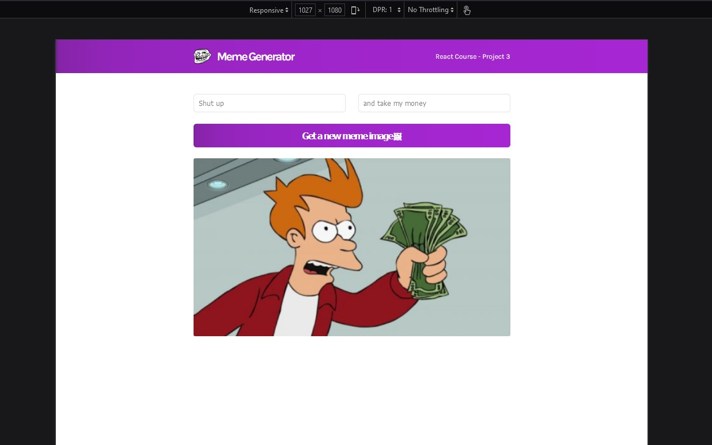

# MemeGenerator Section 3 Project {React Course, Scrimba}

This is a solution to the [MemeGenerator project Section 3 React Course](https://scrimba.com/learn/learnreact/meme-generator-header-cocf84c4c9121d91a0095f3e9).
The course is offered for FREE on Scrimba by Bob Ziroll [Learn React](https://scrimba.com/learn/learnreact)(An amazing tutor -- really understood his course)

I decided to show my travel experience in Watamu, Kenya. I visited this place after completing my 4th Year studies in Uni

## Table of contents

- [Overview](#overview)
  - [The challenge](#the-challenge)
  - [Screenshot](#screenshot)
  - [Links](#links)
- [My process](#my-process)
  - [Built with](#built-with)
  - [What I learned](#what-i-learned)
  - [Continued development](#continued-development)
- [Author](#author) -[Acknowledgments](#acknowledgments)

## Overview

### The challenge

Recreate the memegenerator site from the figma file shared

Requirements : -

- Recreate the memegenerator site as per the figma design

### Screenshot

Screenshot of the Meme Generator mock up



### Links

- Solution URL: [GitHub Link](https://github.com/issagoodlifeInc/memegenerator.git)
- Live Site URL: [Netlify Deploy](https://Memeleskim.netlify.app/)

## My process

1. Recreated the design as per [Figma](https://www.figma.com/file/MoLwFPHNHJVrzdFurxHzNV/Meme-Generator?node-id=0%3A1)

2. Started with the mockup -- deleteting unrequired files and adding the `component` and `images` files to the structure after `create-react-app`

3. Started with the `Navbar` section using a container to set `max-width`

4. Then the `Main` section with the `inputs`, `button`, and `Meme Image`

5. Writing out this `README.md` file

### Built with

- React
- JSX syntax
- Semantic HTML5 markup
- CSS custom properties
- Flexbox

### What I learned

- Using Figma files to code

- ##### Learnt Taking in Form inputs using state to get the data

```JSX
// State
 const [meme, setMeme] = React.useState({
    topText: "",
    bottomText: "",
    randomImg: "https://i.imgflip.com/1g8my4.jpg",
  });

  // Handlechange changes the state on every keystroke for inputs ond changes on checkboxes
  const handleChange = (event) => {
    const { name, value } = event.target;

    setMeme((prevMeme) => ({
      ...prevMeme,
      [name]: value,
    }));
  };

  // Nifty trick
  // [name]: type === checkbox ? checked : value

// The input part
//  the name must be ==== to the object value in state
// the value === its value in state (controlled inputs or smthin)
  <input
          type="text"
          placeholder="Shut up"
          value={meme.topText}
          name="topText"
          onChange={handleChange}
        />
        <input
          type="text"
          placeholder="and take my money"
          value={meme.bottomText}
          name="bottomText"
          onChange={handleChange}
        />
```

- ##### Learning useEffect and Fetching data using fetch()

```JSX
React.useEffect(() => {
    fetch("https://api.imgflip.com/get_memes")
      .then((response) => response.json())
      .then((data) => setAllMeme(data.data.memes));
  }, []);

  // the [] takes in a dependancy array that will rerun useEffect if the array changes ... [] for a blank it just runs once when the page renders

```

- learnt about cleaning up with useEffect (return a function for clean up)
<!-- Used an example of the resizing of the window to toglle a window tracker -->

```JSX
React.useEffect(() => {
        function watchWidth() {
            console.log("Setting up...")
            setWindowWidth(window.innerWidth)
        }

        window.addEventListener("resize", watchWidth)
  // Clean up function to get rid of the memory leak warning
        return function() {
            console.log("Cleaning up...")
            window.removeEventListener("resize", watchWidth)
        }
    }, [])
```

- React! React! React!

### Continued development

- Learning more React! (yeah reenacting React problems and tackling them)

- Better turnaround time -- simple stuff but worked on it for a while

- Less Code (code cleanup)

## Author

- Website - [Lesley Kimutai](https://leskim.github.io/myweb/)
- Frontend Mentor - [Frontend Mentor](https://www.frontendmentor.io/profile/Leskim)
